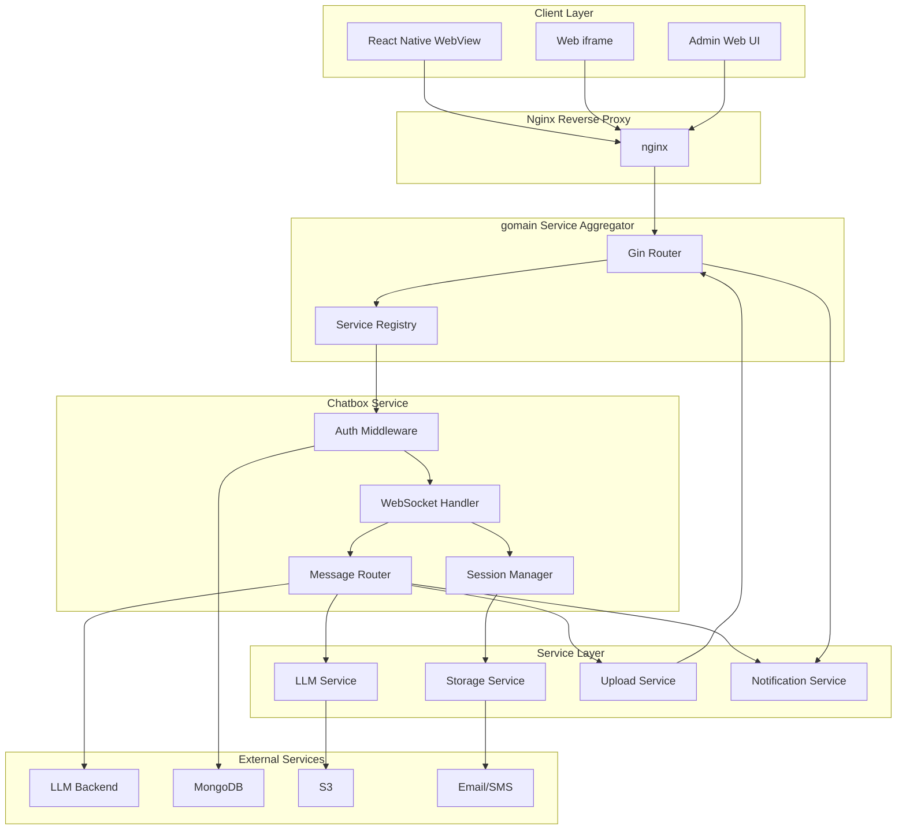

# Design Document: Chat Application WebSocket

## Overview

This design document describes the architecture and implementation approach for a real-time HTML chat application with a Golang WebSocket backend. The system is embedded within existing React Native mobile and web applications, providing AI-powered conversations with support for file uploads, voice messages, session management, and administrative oversight.

The backend leverages company base libraries from github.com/real-rm/* for core functionality:
- **gomain**: Service aggregator and main server entry point with Gin router
- **gomongo**: MongoDB operations with connection pooling, transactions, and logging
- **goupload**: S3 file upload service with validation, signed URLs, and chunked uploads
- **goconfig**: Configuration management from TOML files and environment variables
- **golog**: Structured logging with multiple levels and outputs
- **gohelper**: Common utility functions (UUID generation, email validation, time conversion)
- **gomail**: Email service with multiple engines (SES, SMTP, Mock)
- **gosms**: SMS service with Twilio support

The backend integrates with LLM backends (OpenAI, Anthropic, Dify) for AI responses. The frontend is a lightweight HTML/JavaScript interface that runs in webviews and iframes, communicating via WebSocket protocol.

**Service Registration**: The chatbox service implements a `Register(*gin.Engine, *goconfig.ConfigAccessor, *golog.Logger, *gomongo.Mongo)` function that registers all HTTP and WebSocket routes with the gomain service aggregator.

Key design principles:
- Real-time bidirectional communication using WebSocket
- Stateful session management with reconnection support
- Service-based architecture using gomain for aggregation
- Horizontal scalability for Kubernetes deployment
- Comprehensive logging and monitoring using company libraries
- Security-first approach with JWT authentication and input validation
- Consistent use of company base libraries for maintainability

### Company Repository Access

**Repository Location**: All company base libraries (github.com/real-rm/*) should be cloned to `/Users/fx/work/` as subfolders for local development and reference.

**Access Method**: Use `git` or `gh` commands in the system shell to clone and manage company repositories. The system already has credentials configured.

**Example Commands**:
```bash
# Clone a company repository
cd /Users/fx/work/
git clone https://github.com/real-rm/gomongo.git

# Or using gh CLI
gh repo clone real-rm/gomongo
```

**Available Repositories**:
- `/Users/fx/work/gomain` - Service aggregator and main server
- `/Users/fx/work/gomongo` - MongoDB wrapper library
- `/Users/fx/work/goupload` - File upload service library
- `/Users/fx/work/goconfig` - Configuration management library
- `/Users/fx/work/golog` - Structured logging library
- `/Users/fx/work/gohelper` - Common utility functions library
- `/Users/fx/work/gomail` - Email service library
- `/Users/fx/work/gosms` - SMS service library

## Architecture

### High-Level Architecture



### Component Responsibilities

1. **gomain Service Aggregator**: Main server entry point that manages service lifecycle, configuration, logging, and MongoDB initialization
2. **Chatbox Service Register Function**: Registers all HTTP and WebSocket routes with the Gin router
3. **WebSocket Handler**: Manages WebSocket connections, message parsing, and protocol validation
4. **Session Manager**: Tracks active sessions, handles reconnection, and manages session state
5. **Message Router**: Routes messages between clients, LLM backends, and admin users
6. **Auth Middleware**: Validates JWT tokens and enforces authorization
7. **LLM Service**: Interfaces with AI backends, handles streaming responses, and tracks token usage
8. **Storage Service**: Persists sessions and messages to MongoDB
9. **Upload Service**: Manages file uploads to S3 and generates signed URLs
10. **Notification Service**: Sends email/SMS alerts to administrators

## gomain Integration

### Service Registration

The chatbox service integrates with gomain by implementing a `Register` function that follows the gomain service interface:

```go
package chatbox

import (
    "github.com/gin-gonic/gin"
    "github.com/real-rm/goconfig"
    "github.com/real-rm/golog"
    "github.com/real-rm/gomongo"
)

// Register registers the chatbox service with the gomain router
// This function is called by gomain during service initialization
func Register(r *gin.Engine, config *goconfig.ConfigAccessor, logger *golog.Logger, mongo *gomongo.Mongo) error {
    // Initialize chatbox services
    chatboxLogger := logger.WithGroup("chatbox")
    
    // Create service instances
    storageService := storage.NewStorageService(mongo, "chat", "sessions", chatboxLogger, nil)
    sessionManager := session.NewSessionManager(15*time.Minute, chatboxLogger)
    llmService := llm.NewLLMService(config, chatboxLogger)
    uploadService := upload.NewUploadService("CHAT", "uploads", mongo.Coll("chat", "file_stats"))
    notificationService := notification.NewNotificationService(config, chatboxLogger, mongo)
    
    // Create message router
    messageRouter := router.NewMessageRouter(sessionManager, llmService, uploadService, notificationService, chatboxLogger)
    
    // Create WebSocket handler
    jwtSecret, err := config.ConfigString("chatbox.jwt_secret")
    if err != nil {
        return fmt.Errorf("failed to get JWT secret: %w", err)
    }
    
    validator := auth.NewJWTValidator(jwtSecret)
    wsHandler := websocket.NewHandler(validator, chatboxLogger)
    
    // Register routes
    chatGroup := r.Group("/chat")
    {
        // WebSocket endpoint
        chatGroup.GET("/ws", wsHandler.HandleWebSocket)
        
        // Admin HTTP endpoints
        adminGroup := chatGroup.Group("/admin")
        adminGroup.Use(authMiddleware(validator))
        {
            adminGroup.GET("/sessions", handleListSessions(storageService))
            adminGroup.GET("/metrics", handleGetMetrics(storageService))
            adminGroup.POST("/takeover/:sessionID", handleAdminTakeover(messageRouter))
        }
        
        // Health check endpoints
        chatGroup.GET("/healthz", handleHealthCheck)
        chatGroup.GET("/readyz", handleReadyCheck(mongo))
    }
    
    chatboxLogger.Info("Chatbox service registered successfully")
    return nil
}
```

### Configuration

The chatbox service configuration is added to the main `config.toml` file:

```toml
[app]
port = 8080
shutdown_timeout_s = 5

[chatbox]
jwt_secret = "your-jwt-secret-key"
reconnect_timeout = "15m"
max_connections = 10000
rate_limit = 100

[chatbox.websocket]
read_buffer_size = 1024
write_buffer_size = 1024
pong_wait = "60s"
ping_period = "54s"
write_wait = "10s"

# LLM Providers
[[chatbox.llm.providers]]
id = "openai-gpt4"
name = "GPT-4"
type = "openai"
endpoint = "https://api.openai.com/v1"
apiKey = "sk-..."
model = "gpt-4"

[[chatbox.llm.providers]]
id = "anthropic-claude"
name = "Claude"
type = "anthropic"
endpoint = "https://api.anthropic.com/v1"
apiKey = "sk-ant-..."
model = "claude-3-opus"
```

### Service Lifecycle

1. **Initialization**: gomain loads configuration, initializes logger and MongoDB
2. **Registration**: gomain calls `chatbox.Register()` with shared resources
3. **Runtime**: Chatbox service handles WebSocket connections and HTTP requests
4. **Shutdown**: gomain handles graceful shutdown, closing all connections

### Benefits of gomain Integration

- **Shared Resources**: Logger, config, and MongoDB are initialized once and shared
- **Unified Configuration**: All services use the same config.toml file
- **Graceful Shutdown**: gomain handles SIGTERM/SIGINT signals for all services
- **Service Discovery**: Services can be enabled/disabled via ENABLE_SERVICES environment variable
- **Consistent Logging**: All services use the same structured logging format
- **Health Checks**: Centralized health check endpoints for Kubernetes probes

## Components and Interfaces

### Chatbox Service Entry Point

**Package**: `chatbox`

**Core Function**:
```go
// Register is the main entry point for the chatbox service
// It is called by gomain during service initialization
func Register(r *gin.Engine, config *goconfig.ConfigAccessor, logger *golog.Logger, mongo *gomongo.Mongo) error
```

### WebSocket Handler

**Package**: `internal/websocket`

**Core Types**:
```go
type Handler struct {
    validator *auth.JWTValidator
    logger    *golog.Logger
    connections map[string]*Connection
    mu        sync.RWMutex
}

type Connection struct {
    conn      *websocket.Conn
    userID    string
    sessionID string
    roles     []string
    send      chan []byte
    mu        sync.RWMutex
}
```

**Key Methods**:
- `HandleWebSocket(c *gin.Context)`: Gin handler that upgrades HTTP to WebSocket
- `authenticateConnection(token string) (*Claims, error)`: Validates JWT token
- `readPump(conn *Connection)`: Reads messages from client
- `writePump(conn *Connection)`: Writes messages to client

### Session Manager

**Package**: `internal/session`

**Core Types**:
```go
type SessionManager struct {
    sessions          map[string]*Session
    userSessions      map[string]string  // userID -> active sessionID
    mu                sync.RWMutex
    reconnectTimeout  time.Duration
    logger            *golog.Logger
}

type Session struct {
    ID                string
    UserID            string
    Name              string
    ModelID           string
    Messages          []*Message
    StartTime         time.Time
    LastActivity      time.Time
    EndTime           *time.Time
    IsActive          bool
    AdminAssisted     bool
    AssistingAdminID  string
    AssistingAdminName string
    HelpRequested     bool
    TotalTokens       int
    ResponseTimes     []time.Duration
    mu                sync.RWMutex
}
```

**Key Methods**:
- `CreateSession(userID string) (*Session, error)`: Creates new session
- `GetSession(sessionID string) (*Session, error)`: Retrieves session
- `RestoreSession(userID, sessionID string) (*Session, error)`: Restores session on reconnect
- `EndSession(sessionID string) error`: Marks session as ended
- `ListUserSessions(userID string) ([]*SessionMetadata, error)`: Lists user's sessions
- `GenerateSessionName(firstMessage string) string`: Auto-generates session name
- `MarkAdminAssisted(sessionID, adminID, adminName string) error`: Marks admin takeover
- `UpdateTokenUsage(sessionID string, tokens int) error`: Updates token count
- `RecordResponseTime(sessionID string, duration time.Duration) error`: Records response time

### Message Router

**Package**: `router`

**Core Types**:
```go
type MessageRouter struct {
    llmService     *LLMService
    uploadService  *UploadService
    sessionManager *SessionManager
    connections    map[string]*Connection  // sessionID -> Connection
    adminConns     map[string]*Connection  // adminID -> Connection
    mu             sync.RWMutex
    logger         *Logger
}

type Message struct {
    Type      MessageType       `json:"type"`
    SessionID string            `json:"session_id,omitempty"`
    Content   string            `json:"content,omitempty"`
    FileID    string            `json:"file_id,omitempty"`
    FileURL   string            `json:"file_url,omitempty"`
    ModelID   string            `json:"model_id,omitempty"`
    Timestamp time.Time         `json:"timestamp"`
    Sender    SenderType        `json:"sender"`
    Metadata  map[string]string `json:"metadata,omitempty"`
    Error     *ErrorInfo        `json:"error,omitempty"`
}

type MessageType string
const (
    TypeUserMessage    MessageType = "user_message"
    TypeAIResponse     MessageType = "ai_response"
    TypeFileUpload     MessageType = "file_upload"
    TypeVoiceMessage   MessageType = "voice_message"
    TypeError          MessageType = "error"
    TypeConnectionStatus MessageType = "connection_status"
    TypeTypingIndicator MessageType = "typing_indicator"
    TypeHelpRequest    MessageType = "help_request"
    TypeAdminJoin      MessageType = "admin_join"
    TypeAdminLeave     MessageType = "admin_leave"
    TypeModelSelect    MessageType = "model_select"
    TypeLoading        MessageType = "loading"
)

type SenderType string
const (
    SenderUser  SenderType = "user"
    SenderAI    SenderType = "ai"
    SenderAdmin SenderType = "admin"
)
```

**Key Methods**:
- `RouteMessage(conn *Connection, msg *Message) error`: Routes message to appropriate handler
- `HandleUserMessage(conn *Connection, msg *Message) error`: Processes user messages
- `HandleAdminTakeover(adminConn *Connection, sessionID string) error`: Handles admin joining
- `HandleHelpRequest(conn *Connection) error`: Processes help requests
- `HandleModelSelection(conn *Connection, modelID string) error`: Changes LLM model
- `BroadcastToSession(sessionID string, msg *Message) error`: Sends message to all session participants
- `SendLoadingIndicator(sessionID string, isLoading bool) error`: Shows/hides loading animation

### LLM Service

**Package**: `llm`

**Core Types**:
```go
type LLMService struct {
    providers map[string]LLMProvider
    config    *LLMConfig
    logger    *Logger
}

type LLMProvider interface {
    SendMessage(ctx context.Context, req *LLMRequest) (*LLMResponse, error)
    StreamMessage(ctx context.Context, req *LLMRequest) (<-chan *LLMChunk, error)
    GetTokenCount(text string) int
}

type LLMRequest struct {
    ModelID  string
    Messages []ChatMessage
    Stream   bool
}

type LLMResponse struct {
    Content    string
    TokensUsed int
    Duration   time.Duration
}

type LLMChunk struct {
    Content string
    Done    bool
}
```

**Key Methods**:
- `SendMessage(modelID string, messages []ChatMessage) (*LLMResponse, error)`: Sends message to LLM
- `StreamMessage(modelID string, messages []ChatMessage) (<-chan *LLMChunk, error)`: Streams response
- `GetAvailableModels() []ModelInfo`: Returns configured models
- `ValidateModel(modelID string) error`: Validates model exists

### Storage Service (gomongo)

**Package**: `storage`

**Implementation**: Uses `github.com/real-rm/gomongo` for MongoDB operations

**Initialization**:
```go
// Initialize gomongo with logger and config
mongoClient, err := gomongo.InitMongoDB(logger, configAccessor)
if err != nil {
    log.Fatal(err)
}

// Get collection for sessions
sessionsCollection := mongoClient.Coll("chat", "sessions")

// Create storage service wrapper
storageService := storage.NewStorageService(mongoClient, sessionsCollection, logger)
```

**Core Types**:
```go
type StorageService struct {
    mongo      *gomongo.Mongo
    collection *gomongo.MongoCollection
    logger     *golog.Logger
}

type SessionDocument struct {
    ID                string              `bson:"_id"`
    UserID            string              `bson:"user_id"`
    Name              string              `bson:"name"`
    ModelID           string              `bson:"model_id"`
    Messages          []MessageDocument   `bson:"messages"`
    StartTime         time.Time           `bson:"start_time"`
    EndTime           *time.Time          `bson:"end_time,omitempty"`
    Duration          int64               `bson:"duration"`  // seconds
    AdminAssisted     bool                `bson:"admin_assisted"`
    AssistingAdminID  string              `bson:"assisting_admin_id,omitempty"`
    HelpRequested     bool                `bson:"help_requested"`
    TotalTokens       int                 `bson:"total_tokens"`
    MaxResponseTime   int64               `bson:"max_response_time"`  // milliseconds
    AvgResponseTime   int64               `bson:"avg_response_time"`  // milliseconds
}

type MessageDocument struct {
    Content   string            `bson:"content"`
    Timestamp time.Time         `bson:"timestamp"`
    Sender    string            `bson:"sender"`
    FileID    string            `bson:"file_id,omitempty"`
    FileURL   string            `bson:"file_url,omitempty"`
    Metadata  map[string]string `bson:"metadata,omitempty"`
}
```

**Key Methods**:
- `CreateSession(session *Session) error`: Creates session document using gomongo
- `UpdateSession(session *Session) error`: Updates session document using gomongo
- `GetSession(sessionID string) (*Session, error)`: Retrieves session using gomongo
- `ListUserSessions(userID string, limit int) ([]*SessionMetadata, error)`: Lists sessions with gomongo query options
- `GetSessionMetrics(startTime, endTime time.Time) (*Metrics, error)`: Aggregates metrics using gomongo aggregation
- `GetTokenUsage(startTime, endTime time.Time) (int, error)`: Calculates total tokens using gomongo aggregation

**Benefits of gomongo**:
- Automatic timestamp management (_ts, _mt fields)
- Built-in logging and performance monitoring
- Transaction support for ACID operations
- Connection pooling and retry logic
- Consistent error handling

### Upload Service (goupload)

**Package**: `upload`

**Implementation**: Uses `github.com/real-rm/goupload` for S3 file operations

**Initialization**:
```go
// Initialize goupload with logger and config
if err := goupload.Init(goupload.InitOptions{
    Logger: logger,
    Config: configAccessor,
}); err != nil {
    log.Fatal(err)
}

// Create stats updater for file tracking
mongo, _ := gomongo.InitMongoDB(logger, configAccessor)
statsColl := mongo.Coll("chat", "file_stats")
statsUpdater, err := goupload.NewStatsUpdater("CHAT", "uploads", statsColl)
if err != nil {
    log.Fatal(err)
}

// Create upload service wrapper
uploadService := upload.NewUploadService(statsUpdater, logger)
```

**Core Types**:
```go
type UploadService struct {
    statsUpdater goupload.StatsUpdater
    logger       *golog.Logger
}

type UploadResult struct {
    FileID   string
    FileURL  string
    Size     int64
    MimeType string
}
```

**Key Methods**:
- `UploadFile(file io.Reader, filename string) (*UploadResult, error)`: Uploads file using goupload
- `GenerateSignedURL(fileID string, expiration time.Duration) (string, error)`: Creates signed URL using goupload
- `ValidateFile(file io.Reader, maxSize int64) error`: Validates file before upload
- `DeleteFile(fileID string) error`: Deletes file using goupload

**Configuration** (config.toml):
```toml
# Connection sources for S3
[connection_sources]
  [[connection_sources.s3_providers]]
    name = "aws-chat-storage"
    endpoint = "s3.us-east-1.amazonaws.com"
    key = "YOUR_AWS_ACCESS_KEY"
    pass = "YOUR_AWS_SECRET_KEY"
    region = "us-east-1"

# Upload configuration
[userupload]
site = "CHAT"
  [[userupload.types]]
    entryName = "uploads"
    prefix = "/chat-files"
    tmpPath = "./temp/uploads"
    maxSize = "100MB"
    storage = [
      { type = "s3", target = "aws-chat-storage", bucket = "chat-files" }
    ]
```

**Benefits of goupload**:
- Transactional writes with automatic rollback on failure
- Multi-storage support (local + S3) with failover
- Chunked upload support for large files
- File validation and malicious file scanning
- Automatic path generation with statistics tracking
- Built-in logging and error handling

### Notification Service (gomail, gosms)

**Package**: `notification`

**Implementation**: Uses `github.com/real-rm/gomail` and `github.com/real-rm/gosms`

**Initialization**:
```go
// Initialize gomail
mailer, err := gomail.GetSendMailObj(gomail.MailerOptions{
    Logger: logger,
    Config: configAccessor,
    Mongo:  mongoClient, // Optional: for email logging
})
if err != nil {
    log.Fatal(err)
}

// Initialize gosms
twilioEngine, err := gosms.NewTwilioEngine(accountSID, authToken)
if err != nil {
    log.Fatal(err)
}
smsSender, err := gosms.NewSMSSender(twilioEngine)
if err != nil {
    log.Fatal(err)
}

// Create notification service wrapper
notificationService := notification.NewNotificationService(mailer, smsSender, logger)
```

**Core Types**:
```go
type NotificationService struct {
    mailer      *gomail.Mailer
    smsSender   *gosms.SMSSender
    logger      *golog.Logger
    rateLimiter *RateLimiter
    config      *NotificationConfig
}

type NotificationConfig struct {
    AdminEmails []string
    AdminPhones []string
    Rules       []NotificationRule
}

type NotificationRule struct {
    EventType string
    Channels  []string  // "email", "sms"
    Enabled   bool
}
```

**Key Methods**:
- `SendHelpRequestAlert(userID, sessionID string) error`: Sends alert using gomail/gosms
- `SendCriticalError(errorType, details string, affectedUsers int) error`: Sends error alert
- `SendSystemAlert(message string) error`: Sends general system alert

**Configuration** (config.toml):
```toml
[mail]
defaultFromName = "Chat Support"
replyToEmail = "support@example.com"
adminEmail = "admin@example.com"

# SES Engine for production
[[mail.engines.ses]]
name = "ses-primary"
accessKeyId = "AKIAXXXXXXXX"
secretAccessKey = "xxxxxxxx"
region = "us-east-1"
from = "noreply@example.com"
fromName = "Chat System"

# SMTP Engine for backup
[[mail.engines.smtp]]
name = "smtp-backup"
host = "smtp.example.com"
port = 587
user = "user@example.com"
pass = "password"
from = "noreply@example.com"

# SMS Configuration
[sms]
provider = "twilio"
accountSID = "ACXXXXXXXXXXXXXXXXXXXXXXXXXXXXXXXX"
authToken = "your_auth_token"
fromNumber = "+1234567890"
```

**Benefits of gomail/gosms**:
- Multi-engine support with automatic failover
- Email validation with MX record lookup
- Template support with parameter replacement
- Automatic email logging to MongoDB
- Rate limiting to prevent notification flooding
- Mock engines for testing

### Config Service (goconfig)

**Package**: `config`

**Implementation**: Uses `github.com/real-rm/goconfig` for configuration management

**Initialization**:
```go
// Load configuration from TOML file
if err := goconfig.LoadConfig(); err != nil {
    log.Fatal(err)
}

// Get config accessor
configAccessor, err := goconfig.Default()
if err != nil {
    log.Fatal(err)
}

// Access configuration values
serverPort, err := configAccessor.ConfigInt("server.port")
jwtSecret, err := configAccessor.ConfigString("server.jwtSecret")
mongoURI, err := configAccessor.ConfigString("dbs.chat.uri")
```

**Core Types**:
```go
type Config struct {
    Server       ServerConfig
    LLM          LLMConfig
    Database     DatabaseConfig
    Storage      StorageConfig
    Notification NotificationConfig
    Kubernetes   KubernetesConfig
}

type ServerConfig struct {
    Port              int
    ReconnectTimeout  time.Duration
    MaxConnections    int
    RateLimit         int
}

type LLMConfig struct {
    Providers []LLMProviderConfig
}

type LLMProviderConfig struct {
    ID       string
    Name     string
    Type     string  // "openai", "anthropic", "dify"
    Endpoint string
    APIKey   string
    Model    string
}
```

**Configuration File** (config.toml):
```toml
[server]
port = 8080
reconnectTimeout = "15m"
maxConnections = 10000
rateLimit = 100
jwtSecret = "your-secret-key"

[dbs]
verbose = 1
slowThreshold = 2

[dbs.chat]
uri = "mongodb://localhost:27017/chat"

# LLM Providers
[[llm.providers]]
id = "openai-gpt4"
name = "GPT-4"
type = "openai"
endpoint = "https://api.openai.com/v1"
apiKey = "sk-..."
model = "gpt-4"

[[llm.providers]]
id = "anthropic-claude"
name = "Claude"
type = "anthropic"
endpoint = "https://api.anthropic.com/v1"
apiKey = "sk-ant-..."
model = "claude-3-opus"

# Connection sources for S3
[connection_sources]
  [[connection_sources.s3_providers]]
    name = "aws-chat-storage"
    endpoint = "s3.us-east-1.amazonaws.com"
    key = "YOUR_AWS_ACCESS_KEY"
    pass = "YOUR_AWS_SECRET_KEY"
    region = "us-east-1"

# Upload configuration
[userupload]
site = "CHAT"
  [[userupload.types]]
    entryName = "uploads"
    prefix = "/chat-files"
    tmpPath = "./temp/uploads"
    maxSize = "100MB"
    storage = [
      { type = "s3", target = "aws-chat-storage", bucket = "chat-files" }
    ]

# Mail configuration
[mail]
defaultFromName = "Chat Support"
replyToEmail = "support@example.com"
adminEmail = "admin@example.com"

[[mail.engines.ses]]
name = "ses-primary"
accessKeyId = "AKIAXXXXXXXX"
secretAccessKey = "xxxxxxxx"
region = "us-east-1"
from = "noreply@example.com"
```

**Key Methods**:
- `LoadConfig() error`: Loads configuration from file/environment
- `Default() (*ConfigAccessor, error)`: Gets default config accessor
- `ConfigString(key string) (string, error)`: Gets string value
- `ConfigInt(key string) (int, error)`: Gets integer value
- `ConfigStringWithDefault(key, defaultValue string) (string, error)`: Gets string with default

**Benefits of goconfig**:
- TOML configuration file support
- Multiple configuration files with deep merge
- Environment variable support
- Command-line flag support
- Type-safe accessors with default values
- Dot notation for nested values

### Log Service (golog)

**Package**: `logging`

**Implementation**: Uses `github.com/real-rm/golog` for structured logging

**Initialization**:
```go
// Initialize logger with configuration
logger, err := golog.InitLog(golog.LogConfig{
    Dir:            "logs",
    Level:          "info",
    StandardOutput: true,
    InfoFile:       "info.log",
    WarnFile:       "warn.log",
    ErrorFile:      "error.log",
})
if err != nil {
    log.Fatal(err)
}
defer logger.Close()

// Create module loggers for different components
authLogger := logger.WithGroup("auth")
wsLogger := logger.WithGroup("websocket")
llmLogger := logger.WithGroup("llm")
```

**Usage**:
```go
// Structured logging with key-value pairs
logger.Info("User connected", "user_id", userID, "session_id", sessionID)
logger.Warn("High memory usage", "usage", "85%", "threshold", "80%")
logger.Error("Database error", "error", err, "operation", "insert")

// Formatted logging
logger.Infof("User %s logged in from %s", username, ipAddress)
logger.Errorf("Failed to process message: %v", err)

// Module-specific logging (automatically adds module field)
authLogger.Info("JWT token validated", "user_id", userID)
wsLogger.Debug("Message received", "type", msgType, "size", msgSize)
```

**Benefits of golog**:
- Multiple log levels (Debug, Info, Warn, Error, Fatal)
- Structured logging with automatic JSON formatting
- Modular logging with WithGroup()
- Automatic file information for Warn/Error levels
- Multiple output destinations (file + stdout)
- Built on Go standard library log/slog

### Helper Service (gohelper)

**Package**: `helpers`

**Implementation**: Uses `github.com/real-rm/gohelper` for common utilities

**UUID Generation**:
```go
// Generate session ID
sessionID, err := gohelper.GenUUID(32)
if err != nil {
    return err
}
```

**Email Validation**:
```go
// Validate email format
if !gohelper.IsEmail(email) {
    return errors.New("invalid email format")
}
```

**Time Operations**:
```go
// Convert time to string
timeStr := gohelper.TimeToStr(time.Now())

// Convert string to time
t, err := gohelper.StrToTime("2024-01-15 14:30:45")

// Convert time to date integer (YYYYMMDD)
dateInt := gohelper.TimeToDateInt(time.Now())
```

**Array Operations**:
```go
// Check if item exists in slice
roles := []string{"user", "admin", "moderator"}
isAdmin := gohelper.Contains(roles, "admin")
```

**Benefits of gohelper**:
- Secure UUID generation using crypto/rand
- Email validation with format checking
- Time formatting and conversion utilities
- Generic array operations for any comparable type
- Thread-safe for concurrent use

## Data Models

### Session Data Model

```go
type Session struct {
    // Identity
    ID                string
    UserID            string
    Name              string
    
    // Configuration
    ModelID           string
    
    // Content
    Messages          []*Message
    
    // Timing
    StartTime         time.Time
    LastActivity      time.Time
    EndTime           *time.Time
    
    // State
    IsActive          bool
    HelpRequested     bool
    
    // Admin Assistance
    AdminAssisted     bool
    AssistingAdminID  string
    AssistingAdminName string
    
    // Metrics
    TotalTokens       int
    ResponseTimes     []time.Duration
    
    // Concurrency
    mu                sync.RWMutex
}
```

### Message Data Model

```go
type Message struct {
    Type      MessageType
    SessionID string
    Content   string
    FileID    string
    FileURL   string
    ModelID   string
    Timestamp time.Time
    Sender    SenderType
    Metadata  map[string]string
    Error     *ErrorInfo
}
```

### Connection Data Model

```go
type Connection struct {
    conn      *websocket.Conn
    userID    string
    sessionID string
    roles     []string
    send      chan []byte
    mu        sync.RWMutex
}
```

### Admin Metrics Data Model

```go
type SessionMetrics struct {
    TotalSessions      int
    ActiveSessions     int
    AvgConcurrent      float64
    MaxConcurrent      int
    TotalTokens        int
    AvgResponseTime    time.Duration
    MaxResponseTime    time.Duration
    AdminAssistedCount int
}
```


## WebSocket Protocol Specification

### Connection Establishment

1. Client sends HTTP upgrade request with JWT token in query parameter or header
2. Server validates JWT token
3. Server upgrades connection to WebSocket
4. Server sends connection status message with session information

### Message Format

All messages use JSON format:

```json
{
  "type": "message_type",
  "session_id": "session-uuid",
  "content": "message content",
  "timestamp": "2024-01-01T12:00:00Z",
  "sender": "user|ai|admin",
  "metadata": {
    "key": "value"
  }
}
```

### Message Types

1. **user_message**: User sends text message
2. **ai_response**: AI backend response (may be streamed)
3. **file_upload**: File upload notification
4. **voice_message**: Voice message upload
5. **error**: Error notification
6. **connection_status**: Connection state changes
7. **typing_indicator**: Typing status
8. **help_request**: User requests staff help
9. **admin_join**: Admin joins session
10. **admin_leave**: Admin leaves session
11. **model_select**: User selects different LLM model
12. **loading**: Loading indicator state

### Heartbeat

- Client sends ping every 30 seconds
- Server responds with pong
- Connection closed if no ping received for 90 seconds

### Reconnection Flow

1. Client detects disconnection
2. Client attempts reconnect with exponential backoff (1s, 2s, 4s, 8s, 16s, 30s max)
3. Client sends JWT token and previous session ID
4. Server validates token and checks session timeout
5. If within timeout (15 min default), server restores session
6. If beyond timeout, server creates new session

## Error Handling

### Error Categories

1. **Authentication Errors** (4xx)
   - Invalid JWT token
   - Expired token
   - Insufficient permissions

2. **Validation Errors** (4xx)
   - Invalid message format
   - Missing required fields
   - Invalid file type/size

3. **Service Errors** (5xx)
   - LLM backend unavailable
   - Database connection failure
   - S3 upload failure

4. **Rate Limiting Errors** (429)
   - Too many requests
   - Connection limit exceeded

### Error Response Format

```json
{
  "type": "error",
  "error": {
    "code": "ERROR_CODE",
    "message": "Human-readable error message",
    "recoverable": true,
    "retry_after": 5000
  },
  "timestamp": "2024-01-01T12:00:00Z"
}
```

### Error Handling Strategy

1. **Recoverable Errors**: Send error message, keep connection open
2. **Fatal Errors**: Send error message, close connection gracefully
3. **LLM Backend Failures**: Retry with exponential backoff (3 attempts)
4. **Database Failures**: Log error, notify admins, return generic error to client
5. **File Upload Failures**: Return specific error, allow retry

### Logging

All errors logged with:
- Timestamp
- User ID
- Session ID
- Error type and message
- Stack trace (for server errors)
- Request context

## Testing Strategy

### Unit Testing

**Framework**: Go's built-in `testing` package with `testify` for assertions

**Coverage Target**: Minimum 80% code coverage

**Test Organization**:
- Each package has corresponding `_test.go` files
- Use table-driven tests for multiple input scenarios
- Mock external dependencies (MongoDB, S3, LLM backends)

**Key Unit Tests**:
1. JWT token validation
2. Message protocol parsing and validation
3. Session state transitions
4. Token usage calculations
5. Response time calculations
6. Session name generation
7. Error handling and recovery
8. Rate limiting logic

**Example Test Structure**:
```go
func TestSessionManager_CreateSession(t *testing.T) {
    tests := []struct {
        name    string
        userID  string
        want    *Session
        wantErr bool
    }{
        {
            name:   "valid user",
            userID: "user-123",
            want:   &Session{UserID: "user-123"},
            wantErr: false,
        },
        {
            name:   "empty user ID",
            userID: "",
            want:   nil,
            wantErr: true,
        },
    }
    
    for _, tt := range tests {
        t.Run(tt.name, func(t *testing.T) {
            sm := NewSessionManager(mockStorage, mockLogger)
            got, err := sm.CreateSession(tt.userID)
            if tt.wantErr {
                assert.Error(t, err)
            } else {
                assert.NoError(t, err)
                assert.Equal(t, tt.want.UserID, got.UserID)
            }
        })
    }
}
```

### Integration Testing

**Framework**: Go's `testing` package with Docker containers for dependencies

**Test Scenarios**:
1. **End-to-End Message Flow**:
   - Client connects → sends message → LLM processes → client receives response
   - Verify message persistence in MongoDB
   - Verify token usage tracking

2. **File Upload Flow**:
   - Client uploads file → S3 storage → URL generation → message with file link
   - Verify file accessibility

3. **Admin Takeover Flow**:
   - User requests help → admin notified → admin joins → messages routed correctly
   - Verify session locking and admin name display

4. **Reconnection Flow**:
   - Client connects → disconnects → reconnects within timeout → session restored
   - Client reconnects after timeout → new session created

5. **Multi-Model Selection**:
   - Client selects model A → sends message → response from model A
   - Client switches to model B → sends message → response from model B

**Test Environment**:
- Use Docker Compose for MongoDB, S3 (MinIO), and mock LLM server
- Use testcontainers-go for programmatic container management
- Clean up test data after each test

### Property-Based Testing

**Framework**: `gopter` (Go property testing library)

**Configuration**: Minimum 100 iterations per property test

**Test Tagging**: Each property test includes comment with feature name and property number

**Example**:
```go
// Feature: chat-application-websocket, Property 1: Message parsing round trip
func TestProperty_MessageParsingRoundTrip(t *testing.T) {
    properties := gopter.NewProperties(nil)
    properties.Property("parsing then serializing preserves message", 
        prop.ForAll(
            func(msg *Message) bool {
                json, _ := json.Marshal(msg)
                var parsed Message
                json.Unmarshal(json, &parsed)
                return reflect.DeepEqual(msg, &parsed)
            },
            genMessage(),
        ))
    properties.TestingRun(t, gopter.ConsoleReporter(false))
}
```

### Test Doubles

**Mocking Strategy**:
- Use interfaces for all external dependencies
- Generate mocks using `mockery` tool
- Mock: MongoDB client, S3 client, LLM providers, notification services

**Example Interface**:
```go
type LLMProvider interface {
    SendMessage(ctx context.Context, req *LLMRequest) (*LLMResponse, error)
    StreamMessage(ctx context.Context, req *LLMRequest) (<-chan *LLMChunk, error)
}

// Generated mock
type MockLLMProvider struct {
    mock.Mock
}

func (m *MockLLMProvider) SendMessage(ctx context.Context, req *LLMRequest) (*LLMResponse, error) {
    args := m.Called(ctx, req)
    return args.Get(0).(*LLMResponse), args.Error(1)
}
```

### Frontend Testing

**Framework**: Jest for JavaScript unit tests, Playwright for E2E tests

**Unit Tests**:
- WebSocket connection management
- Message rendering
- File upload UI
- Voice recording UI
- Session list navigation

**E2E Tests**:
- Complete user journey: connect → send message → receive response
- File upload and download
- Voice message recording and playback
- Admin takeover from user perspective
- Model selection

### Performance Testing

**Tools**: `vegeta` for load testing, `pprof` for profiling

**Scenarios**:
1. Concurrent connections: 1000 simultaneous WebSocket connections
2. Message throughput: 100 messages/second
3. File uploads: 50 concurrent uploads
4. Admin monitoring: Dashboard with 10,000 sessions

**Metrics**:
- Response time (p50, p95, p99)
- Memory usage
- CPU usage
- Connection establishment time
- Message latency

### Test Data Management

**Strategy**:
- Use factories for generating test data
- Use fixtures for consistent test scenarios
- Clean up test data after each test
- Use separate test database

**Example Factory**:
```go
func NewTestSession(userID string) *Session {
    return &Session{
        ID:           uuid.New().String(),
        UserID:       userID,
        Name:         "Test Session",
        StartTime:    time.Now(),
        IsActive:     true,
        Messages:     []*Message{},
        TotalTokens:  0,
    }
}
```


## Correctness Properties

A property is a characteristic or behavior that should hold true across all valid executions of a system—essentially, a formal statement about what the system should do. Properties serve as the bridge between human-readable specifications and machine-verifiable correctness guarantees.

### Property 1: JWT Token Validation

*For any* JWT token, the WebSocket_Server should accept the token if and only if it has a valid signature and has not expired, and should reject all invalid or expired tokens with an unauthorized error.

**Validates: Requirements 1.1, 1.3**

### Property 2: JWT Claims Extraction Round Trip

*For any* valid JWT token with user ID and roles claims, extracting the claims from the token should produce values that match the original encoded values.

**Validates: Requirements 1.2**

### Property 3: Connection User Association

*For any* authenticated connection, the connection should always be associated with the user ID extracted from the JWT token.

**Validates: Requirements 1.4**

### Property 4: WebSocket Connection Establishment

*For any* valid authentication token, initiating a connection should result in a successfully established bidirectional WebSocket connection.

**Validates: Requirements 2.1**

### Property 5: Heartbeat Response

*For any* active connection, sending a ping message should result in receiving a pong response.

**Validates: Requirements 2.2**

### Property 6: Session Continuity Timeout

*For any* session, if a connection reconnects within the configured timeout period, the previous session should be restored; if reconnecting after the timeout, a new session should be created.

**Validates: Requirements 2.4, 2.5**

### Property 7: Connection Resource Cleanup

*For any* connection that is closed gracefully, all associated resources (memory, connection maps, channels) should be cleaned up and no longer accessible.

**Validates: Requirements 2.6**

### Property 8: Concurrent Connection Support

*For any* set of authenticated users, the WebSocket_Server should support simultaneous connections from all users without interference.

**Validates: Requirements 2.7**

### Property 9: Message Format Validation

*For any* incoming message, the WebSocket_Server should accept it if it conforms to the protocol specification and reject it with a protocol error if it does not.

**Validates: Requirements 3.1, 3.4, 8.4, 8.5**

### Property 10: Valid Message Routing to LLM

*For any* valid user message, the WebSocket_Server should forward it to the LLM_Backend for processing.

**Validates: Requirements 3.2**

### Property 11: LLM Response Delivery

*For any* LLM_Backend response, the WebSocket_Server should deliver it to the correct Chat_Client through the WebSocket connection.

**Validates: Requirements 3.3**

### Property 12: Message Order Preservation

*For any* sequence of messages sent within a single session, the messages should be processed and stored in the same order they were sent.

**Validates: Requirements 3.5**

### Property 13: Response Time Tracking

*For any* LLM_Backend request, the WebSocket_Server should measure and log the response time, and this time should be included in session metrics.

**Validates: Requirements 3.7, 18.10**

### Property 14: Session Creation and Persistence

*For any* new session, the Storage_Service should create a session record in MongoDB with a unique identifier, user ID, start timestamp, and all required metadata fields.

**Validates: Requirements 4.1**

### Property 15: Message Persistence

*For any* message sent or received in a session, the Storage_Service should immediately persist it to the session record with all required fields (content, timestamp, sender type, metadata).

**Validates: Requirements 4.2, 4.6**

### Property 16: Conversation History Retrieval

*For any* session with stored messages, retrieving the conversation history should return all messages ordered by timestamp.

**Validates: Requirements 4.3**

### Property 17: Multiple Sessions Per User

*For any* user, the Storage_Service should support creating and storing multiple distinct session records.

**Validates: Requirements 4.5**

### Property 18: Session Lifecycle Tracking

*For any* session that ends, the Storage_Service should update the session record with end timestamp and calculated duration.

**Validates: Requirements 4.7**

### Property 19: File Upload and Identifier Generation

*For any* valid file upload, the Upload_Service should store the file on S3 and return a unique file identifier and access URL.

**Validates: Requirements 5.1**

### Property 20: File Upload Notification

*For any* successful file upload, the WebSocket_Server should send a message to the session containing the file identifier, URL, and metadata.

**Validates: Requirements 5.2**

### Property 21: Signed URL Generation

*For any* file download request, the Upload_Service should generate a signed URL with an expiration time that allows access to the file.

**Validates: Requirements 5.3**

### Property 22: File Validation

*For any* file upload attempt, the Upload_Service should validate the file size and type, rejecting files that exceed limits or have invalid types.

**Validates: Requirements 5.4**

### Property 23: File Upload Error Handling

*For any* failed file upload, the WebSocket_Server should notify the Chat_Client with an error message including the failure reason.

**Validates: Requirements 5.5**

### Property 24: AI-Generated File Handling

*For any* file generated by the LLM_Backend, the WebSocket_Server should either store it on S3 or accept the external URL and include the download link in the response message.

**Validates: Requirements 5.6**

### Property 25: Voice Message Routing

*For any* uploaded voice message, the WebSocket_Server should send the audio file reference to the LLM_Backend for transcription or processing.

**Validates: Requirements 6.3**

### Property 26: Voice Response Formatting

*For any* voice response generated by the LLM_Backend, the WebSocket_Server should include the audio file URL in the response message.

**Validates: Requirements 6.5**

### Property 27: LLM Request Context Inclusion

*For any* message forwarded to the LLM_Backend, the request should include both the session context and the user message.

**Validates: Requirements 7.2**

### Property 28: Streaming Response Forwarding

*For any* LLM_Backend that supports streaming, response chunks should be forwarded to the Chat_Client in real-time as they are received.

**Validates: Requirements 7.3**

### Property 29: LLM Backend Retry Logic

*For any* LLM_Backend failure, the WebSocket_Server should return an error message and retry the request with exponential backoff.

**Validates: Requirements 7.4**

### Property 30: Model Selection Persistence

*For any* session where a user selects a different LLM model, all subsequent requests in that session should use the selected model.

**Validates: Requirements 7.7**

### Property 31: JSON Message Format

*For any* WebSocket message sent by the Chat_System, the message should be valid JSON and parseable without errors.

**Validates: Requirements 8.1**

### Property 32: Message Type Field Presence

*For any* message sent by the Chat_System, the message should include a message type field identifying its purpose.

**Validates: Requirements 8.2**

### Property 33: Error Message Generation

*For any* error that occurs, the WebSocket_Server should send an error message to the Chat_Client with error type, description, and recoverability flag.

**Validates: Requirements 9.1, 9.2**

### Property 34: Fatal Error Connection Closure

*For any* fatal error, the WebSocket_Server should send the error message and then close the connection gracefully.

**Validates: Requirements 9.3**

### Property 35: Error Logging Completeness

*For any* error that occurs, the Log_Service should log it with all required context fields (timestamp, user ID, session ID, stack trace).

**Validates: Requirements 9.4**

### Property 36: Structured Log Field Inclusion

*For any* logged event, the Log_Service should include structured fields (timestamp, level, user ID, session ID, component, message).

**Validates: Requirements 10.3**

### Property 37: Significant Event Logging

*For any* significant event (connection, disconnection, message exchange, error, LLM interaction), the WebSocket_Server should generate a log entry.

**Validates: Requirements 10.4**

### Property 38: Critical Error Notification

*For any* critical error, the Notification_Service should send alerts to administrators via configured channels (email or SMS).

**Validates: Requirements 11.1**

### Property 39: Notification Type Support

*For any* supported event type (service crash, LLM failure, database failure, abnormal traffic), the Notification_Service should trigger appropriate notifications.

**Validates: Requirements 11.3**

### Property 40: Notification Rate Limiting

*For any* rapid sequence of critical events, the Notification_Service should implement rate limiting to prevent flooding administrators with notifications.

**Validates: Requirements 11.4**

### Property 41: Notification Content Completeness

*For any* notification sent, it should include error details, affected users count, and timestamp.

**Validates: Requirements 11.5**

### Property 42: Input Sanitization

*For any* user input received, the WebSocket_Server should validate and sanitize it before processing to prevent injection attacks.

**Validates: Requirements 13.2**

### Property 43: Rate Limiting Enforcement

*For any* user making excessive requests, the WebSocket_Server should throttle or reject requests to prevent abuse.

**Validates: Requirements 13.3**

### Property 44: Data Encryption at Rest

*For any* sensitive data stored in MongoDB, the Storage_Service should encrypt it at rest.

**Validates: Requirements 13.4**

### Property 45: Malicious File Detection

*For any* file upload, the Upload_Service should validate the file content and reject malicious files before storing on S3.

**Validates: Requirements 13.5**

### Property 46: Session List Ordering

*For any* user's session list request, the sessions should be returned ordered by most recent activity (last message timestamp).

**Validates: Requirements 15.1**

### Property 47: Session History Loading

*For any* session selected from the list, loading that session should retrieve and display all conversation history for that session.

**Validates: Requirements 15.3**

### Property 48: Single Active Session Constraint

*For any* user, attempting to create or activate a second concurrent session should be prevented while an active session exists.

**Validates: Requirements 15.4**

### Property 49: Automatic Session Name Generation

*For any* new session, the Chat_System should automatically generate a descriptive session name based on the initial conversation content.

**Validates: Requirements 15.5**

### Property 50: Session Metadata Completeness

*For any* session in the session list, the metadata should include name, last message timestamp, message count, and admin-assisted flag.

**Validates: Requirements 15.6, 15.7**

### Property 51: Help Request State Update

*For any* help request initiated by a user, the WebSocket_Server should mark the session as requiring assistance and persist this state.

**Validates: Requirements 16.2, 16.5**

### Property 52: Help Request Notification

*For any* help request created, the Notification_Service should send email and SMS notifications to all Chat_Admin users with user ID, session ID, and access link.

**Validates: Requirements 16.3, 16.4**

### Property 53: Admin Takeover Connection

*For any* admin takeover, the WebSocket_Server should establish a connection for the Chat_Admin to the user's session.

**Validates: Requirements 17.3**

### Property 54: Bidirectional Message Routing During Takeover

*For any* active admin takeover, messages from both the user and Chat_Admin should be routed to each other.

**Validates: Requirements 17.4**

### Property 55: Admin-Assisted Session Marking

*For any* session where an admin takeover ends, the session should be marked with an admin-assisted flag.

**Validates: Requirements 17.6**

### Property 56: Session Takeover Event Logging

*For any* session takeover, the WebSocket_Server should log the event with Chat_Admin ID, start time, and end time.

**Validates: Requirements 17.7**

### Property 57: Admin Session Locking

*For any* session being assisted by a Chat_Admin, the session should be marked as "assisted by [Admin Name]" and prevent other Chat_Admin users from joining.

**Validates: Requirements 17.8**

### Property 58: Session Metrics Calculation

*For any* time period, the WebSocket_Server should calculate and return accurate metrics including total sessions, average concurrent sessions, and maximum concurrent sessions.

**Validates: Requirements 18.2**

### Property 59: Session Timing Tracking

*For any* connection, the WebSocket_Server should track session start time, end time, and duration.

**Validates: Requirements 18.3**

### Property 60: Session Metrics Persistence

*For any* session, the WebSocket_Server should persist session metrics to the Storage_Service for historical analysis.

**Validates: Requirements 18.6**

### Property 61: Admin Authorization Check

*For any* request to the Admin_UI, the WebSocket_Server should verify administrator role from the JWT_Token before displaying monitoring data.

**Validates: Requirements 18.8**

### Property 62: Token Usage Tracking and Storage

*For any* LLM_Backend request, the WebSocket_Server should track token usage and store the total token count in the session metadata.

**Validates: Requirements 18.13, 18.14**

